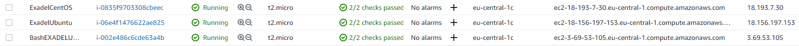
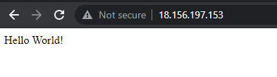
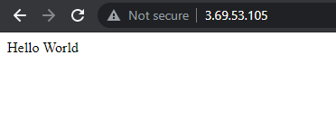
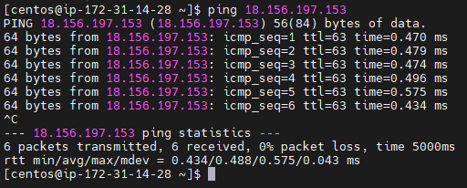
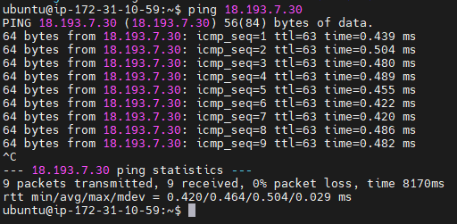

# EC2 instance (Task2)
In this template you can see Exadel intership task 2 solution

### **Step 1**
Created 3 instances in AWS



1. Manually configured server (Ubuntu) 
2. Autoconfigured instance (Ubuntu)
3. To check ping between instances (CentOS)

### **Step 2**
Manually configured instance (http://3.69.49.61)
result after configuration:



**Notice:** on instance https not configured thats why you must use http only

### **Step 3**
Autoconfigured instance (http://18.196.41.225)
result after configuration:



**Notice:** on instance https not configured thats why you must use http only

**BASH script**
autoconfigure BASH script is inside of ***bash01.txt*** file

```$sh bash01.sh```

### **Step 4**
CentOS instance this instance is checks ping to other instances
1. Ping to manually configured instance



2. Ping to manually configured instance


3. Ping from autoconfigured instance to centos


