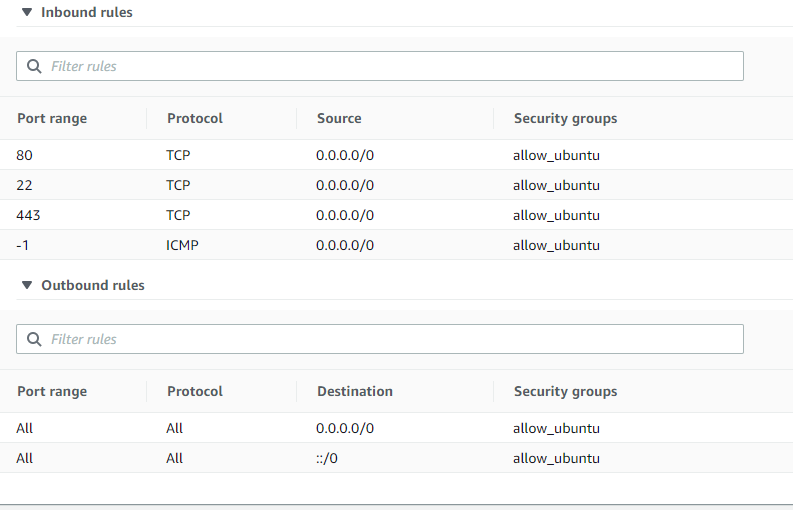

# EC2 instance (Task3)

Terraform configured to create instances and installed docker and nginx
auto generated page shows server os version
 
All process is automated using Terraform

 ```main.tf``` contains first requirements

### **Terraform action 1** 
Created instances 


### **Terraform action 2** 
secure groupes for instances


### **Terraform action 3** 
port bounds from Ubuntu



### **Terraform action 4** 
port bounds from CentOs


### **Terraform action 5** 
webscreen describing os version


### **Terraform action 6** 
docker running on ubuntu


# Extra task