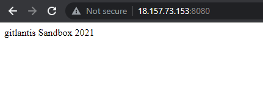
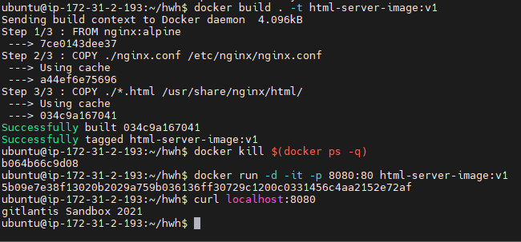
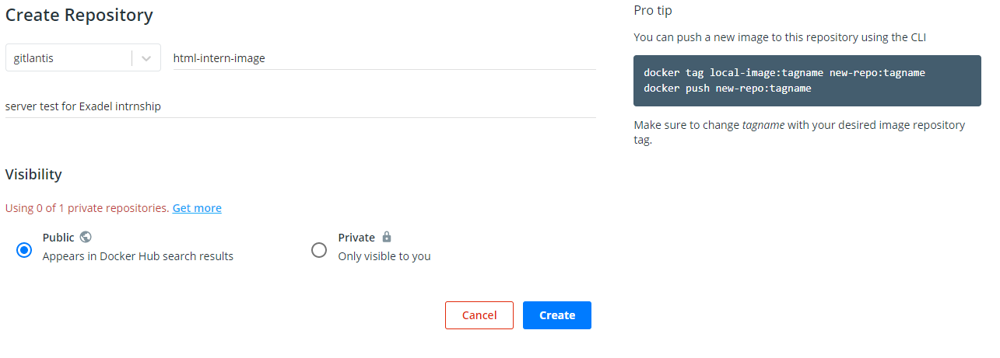
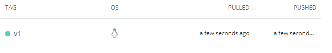
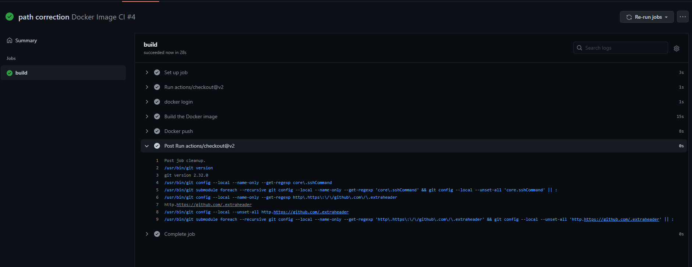

# Docker task (Task04)

Docker image example experience task.
for this solution used Ubuntu 20.04 LTS AWS instance

#### 1. Started Ubuntu 20.04 intance on AWS
 
in the task it is required to use VM for this task, 
to install docker manually you can use following link:

[manual installation](https://phoenixnap.com/kb/how-to-install-docker-on-ubuntu-18-04)

Update the local database with the command:

```sudo apt-get update```

Download Dependencies

```sudo apt-get install apt-transport-https ca-certificates curl software-properties-common```

Add Docker’s GPG Key

```curl -fsSL https://download.docker.com/linux/ubuntu/gpg | sudo apt-key add –```

Install the Docker Repository

```sudo add-apt-repository "deb [arch=amd64] https://download.docker.com/linux/ubuntu  $(lsb_release -cs)  stable" ```


Update the repositories you just added:

```sudo apt-get update```

Install Latest Version of Docker

```sudo apt-get install docker-ce```

open access to current user to execute docker command

```sudo chmod 666 /var/run/docker.sock```

##### **Extra 1.1**

auto instal bash scrip is inside of ```extra1.1/docker-install.sh``` file

```sh docker-install.sh```

#### 2. pulling contaier and running it

I am going to pull hello-world container to test it.

```docker run hello-world```

[https://hub.docker.com/_/hello-world](https://hub.docker.com/_/hello-world)

if this container is not exist it pulls automatically from docker hub

##### **Extra 2.1**

inside of ```extra1.1``` folder you can see folder ```hello-world-html```
this folder contains nginx configuration ```index.html``` cources to copy container.

building container
```docker build . -t html-server-image:v1```

running it on local port ```8080```
```docker run -it -d -p 8080:80 html-server-image:v1```





killing all containers

```docker kill $(docker ps -q)```

to remove all images

```docker rmi -f $(docker images -a -q)```

#### 3.1 executed in extra 2.1 
required solution executed in extra 2.1 that I created own docker image

##### Extra 3.1.1
container contains Alphine OS with nginx installed

#### 3.2 Environment variable added by docker command

build nginx container 

added ```DEVOPS``` variable into ```Dockerfile```

```ENV DEVOPS="gitlantis"```

##### Extra 3.2.1

to print new environment variablevariable on a web page  run this command:

```docker run -e DEVOPS="User2" -it -d -p 8086:80 html-server-image:v1```

#### 4. Docker image created with name ```html-server-image:v1``` push name will be ```html-intern-image:v1```



commands to push repository
```sh
docker tag html-server-image:v1 gitlantis/html-intern-image:v1
docker push gitlantis/html-intern-image:v1
 ```

 

##### Extra 4.1

created workflow to build and push image to docker hub



process completed successfully

```yaml``` configuration file is inside of ```.github/workflows/main.yaml```

### 5 ```docker-compose.yaml``` composes three images

1. ```web``` ```html-server-image``` builds from last example
2. ```app``` [Jetty](https://hub.docker.com/_/jetty) Java app it requires installing mysql 
3. ```db``` [MySQL](https://hub.docker.com/_/mysql) MySql image 

to compose and run after completion task:

```docker-compose up --detach```

#### Extra 5.1 
```./extra5.1/``` contains 4 files
- ```docker-compose.yaml``` docker compose file  
- ```web.env``` environment variables for web container
- ```app.env``` environment variables for app container
- ```db.env``` environment variables for db container

```docker-compose up --detach```

Success