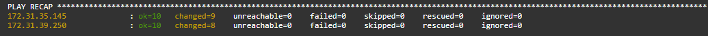

# Ansible task (Task05)
Created Ubuntu as a control panel and two instances as worker machine


ping to hosts using ssh key:

```sudo ansible all -i hosts -m ping -v --private-key testKey.pem -u centos```


## Installing Docker
you must have to install packages into inventory hosts

ansible install script is inside of ```install-docker.yaml```

```sudo ansible-playbook -i hosts -v --private-key ASPair01.pem install-docker.yaml```



## EXTRA 1


## EXTRA 2
## EXTRA 3