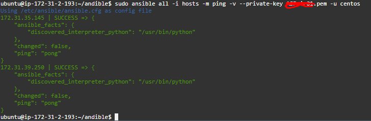

# Ansible task (Task05)
Created Ubuntu as a control panel and two instances as worker machine


ping to hosts using ssh key:

```sudo ansible all -i hosts -m ping -v --private-key testKey.pem -u centos```



## Installing Docker
you must have to install packages into inventory hosts

ansible install script is inside of ```install-docker.yaml```

```sudo ansible-playbook -i hosts -v --private-key *****.pem install-docker.yaml```


## EXTRA 1

for this extra task used ubuntu machines

folder ```extra1``` contains ansible scripit ```install-wpdocker.yaml``` that installs docker in to two instances with wordpress inside of them


```sudo ansible-playbook -i hosts -v --private-key *****.pem install-docker.yaml```

## EXTRA 2

```extra2``` folder contains two files ```docker-compose.yaml``` and ```install-docker.yaml``` 

docker compose have two containers ```wordpress``` and ```mysql```

default passwords are changed for each other.

```sudo ansible-playbook -i hosts -v --private-key *****.pem install-docker.yaml```

## EXTRA 3

for this solution I am going to install playbook from extra 2 task in to all dynamic instances to port 8082 

**1. We must configure dynamic hosts first. 

**required packages for OS:**  boto3

### **1. configure dynamic instances**
create configuration file to store role ```/extra3/aws_ec2.yaml```

```sudo vi aws_ec2.yaml```

- open ```/etc/ansible/ansible.cfg```
- add ```enable_plugins = aws_ec2``` to ```[inventory]``` section
- add ```inventory = /external3/aws_ec2``` to ```[defaults]``` section, this will get all hosts if no cutom hosts files are not specified

to test ping to all instances
```sudo ansible all -m ping -v --private-key ******.pem -u testuser```


### **2. install wordpress to all instances**

```sudo ansible-playbook --private-key *****.pem -u testuser /extra2/install-docker.yaml --limit '!own_ip'```

