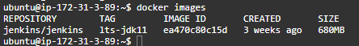
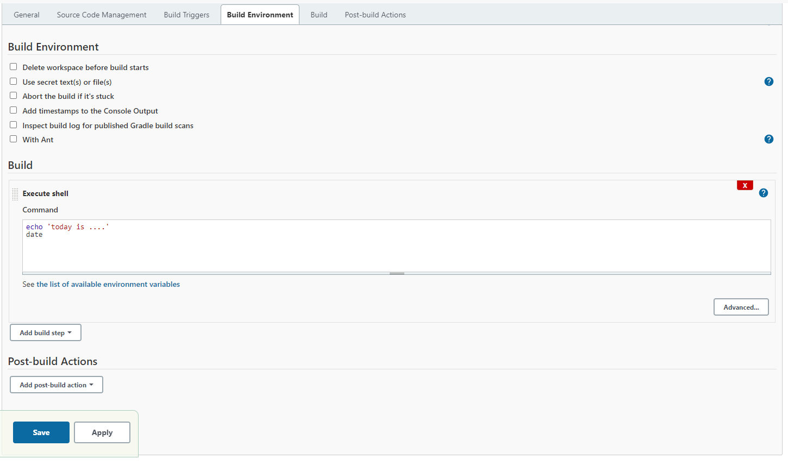
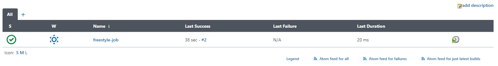
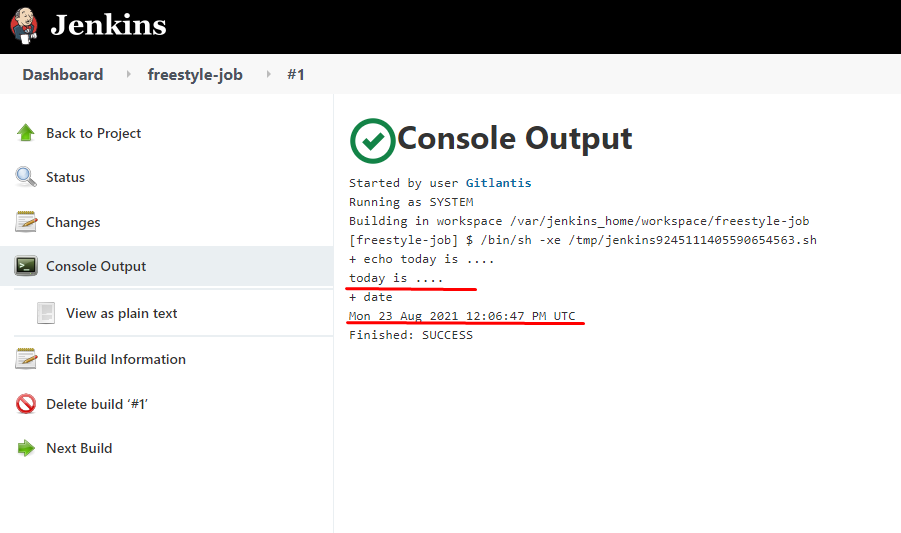

# Jenkins task (Task06)

following you can see jenkins image running on port ```8080```

```docker run -p 8080:8080 -p 50000:50000 -v jenkins_home:/var/jenkins_home jenkins/jenkins:lts-jdk11```


### **Freestyle Job**

created freestyle job echoes ```today is ....``` and prints datetime 

**configuration:**





**result:**




to create docker agents we have to install ```docker pipeline``` plugin

