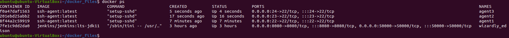
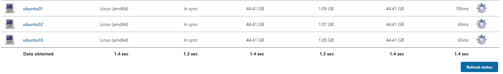

# Jenkins task (Task06)

following you can see jenkins image running on port ```8080```

```docker run -p 8080:8080 -p 50000:50000 -v jenkins_home:/var/jenkins_home jenkins/jenkins:lts-jdk11```


### **Creating docker agets using docker images**

[Container agent documentation](https://www.jenkins.io/doc/book/using/using-agents/)

custom ssh-agent docker files path: ```jenkins-ssh-agent/Dockerfile```

build image: ```docker build --tag="ssh-agent" .```

run docker: 
```docker run -v /var/run/docker.sock:/var/run/docker.sock -d --rm --name=agent1 -p 22:22 -e "JENKINS_AGENT_SSH_PUBKEY=[public key]]" ssh-agent:latest```

created three docker qagents, working on ssh ports 22, 23, 24 



### **Freestyle Job**

created freestyle job echoes ```today is ....``` and prints datetime 

**configuration:**


**result:**


### **Creating pipeline**

pipeline configuration is in ```jenkins-agents``` file
console log is insid of ```jenkins-agents_log``` file

it prints ```docker ps -a ``` afrter completing every stage.

### **Encrypted variables**

folder ```docker-encrypt``` contains solution from previous task, pushid to dockerhub: ```gitlantis/docker-encrypt:latest```


Task06/docker-encrypt/jenkins-encrypt
---------  fake   -------------
to create docker agents we have to install ```docker pipeline``` plugin
three agens agents creationscript is inide of ```jenkins-docker-agents```
1. ```nginx```
2. ```node```
3. ```mysql```

after running each agent prints own version 

log file is inside of ```jenkins-docker-agents_log.txt```


### **Three agents installed docker in them**
Jenkins docker image running on local machine. 
To install virtualbox inside of virtual OS I have got some troubles,
that's why I made desition to install jenkins image on my local machine 
and running three agents using virtualbox.


We have to add nodes first:



agents are connected successfully.

configuration file is ```jenkins_agents``` and build resutlt log is inside of ```jenkins-agents_log.txt```

### unsucessfully completed encryption task

folder ```jenkins_docker``` contains encryption method

#### 1 build image ```jenkins_docker/hello-world-html``` from previous task

```docker build --tag="html-image" .```

created exrternal secret using following command:

```echo "TestUser02" | docker secret create my_secret -```


deployed using ```jenkins_docker/docker-compose.yaml```

```docker stack deploy -c docker-compose.yaml external_secret```

image build unsucessfully I cannot read encrypted value from ```/run/secrets/my_secret``` diraectory


