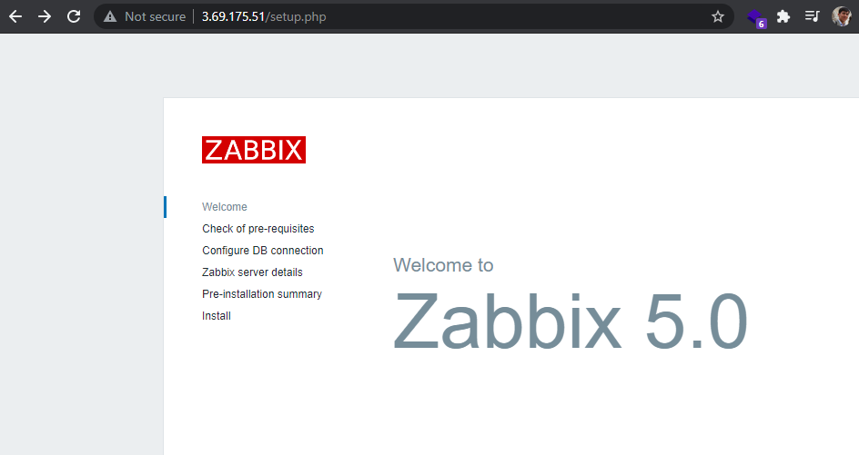
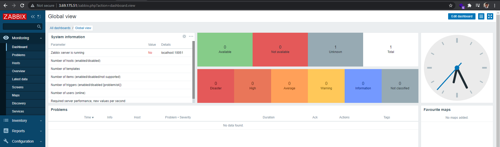
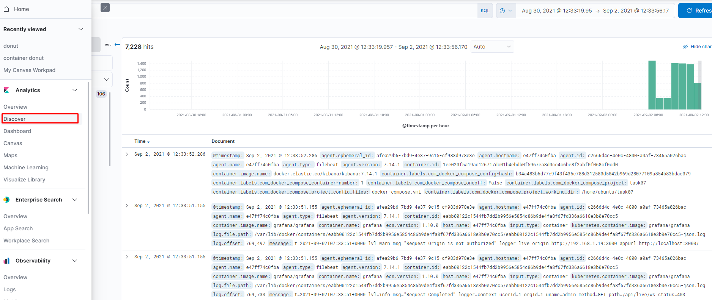
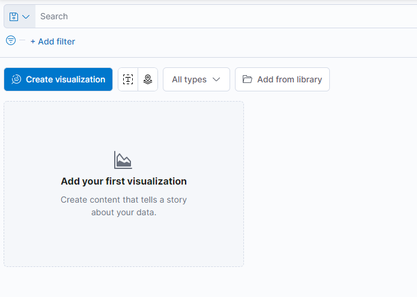
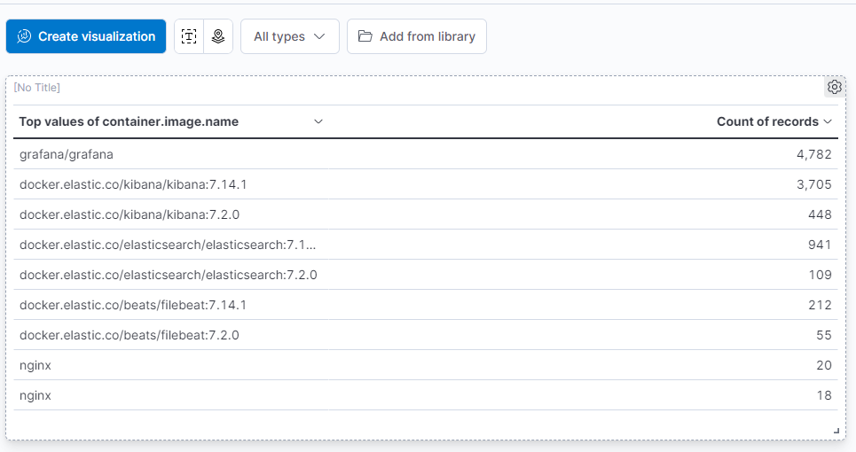
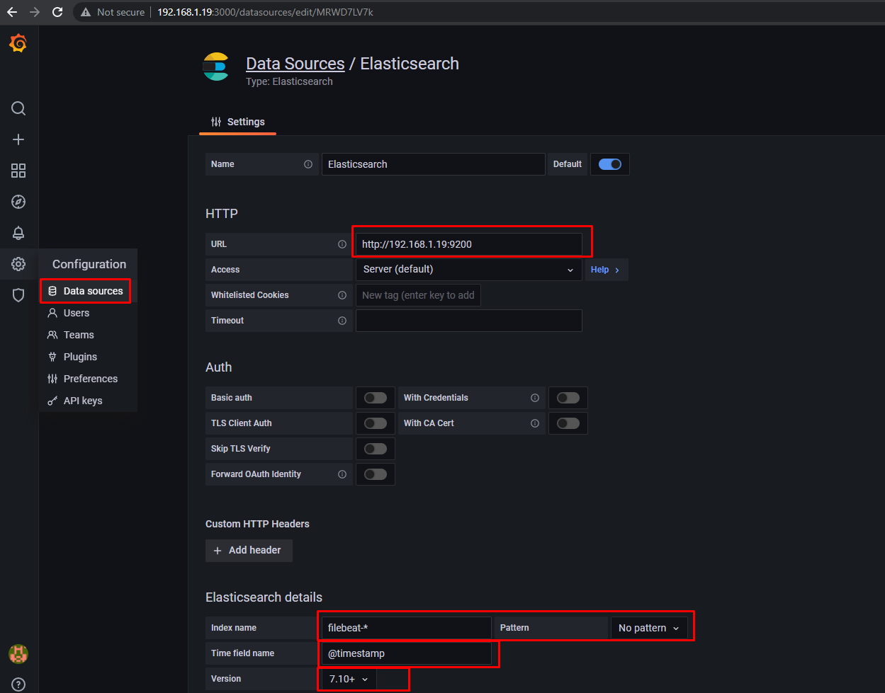
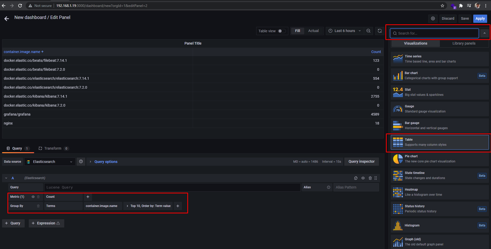
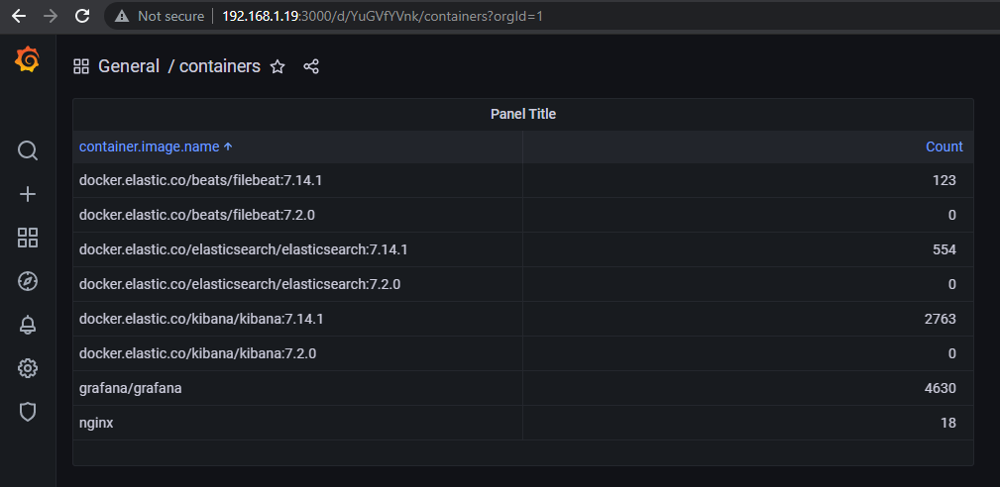

# Monnitoring (Task07)

## 1. Zabbix
### 1.1 Install on server, configure web and base

prereqisits:
- nginx
- mysql

Installation will go on prepeated ```Ubuntu VM```

To install zabbix used this [documentation](https://www.zabbix.com/download?zabbix=5.0&os_distribution=ubuntu&os_version=20.04_focal&db=mysql&ws=nginx)



result after configuration


### 1.2 Prepare VM or instances. Install Zabbix agents on previously prepared servers or VM.

```sudo apt update```

```sudo apt install zabbix-agent```

Configuring zabbix agent:

```sudo nano /etc/zabbix/zabbix_agentd.conf```

------------------
```sh

#zabbix server address
Server=192.168.10.2

#Specify Zabbix server ( For active checks)
ServerActive=192.168.10.2

#agent's hostname
Hostname=ip-172-31-11-76.eu-central-1.compute.internal
```

```sudo systemctl restart zabbix-agent```

```sudo systemctl status zabbix-agent```

## 2. ELK: Nobody is forgotten and nothing is forgotten.

### 2.1 Install and configure ELK

- Elasticsearch: a distributed RESTful search engine which stores all of the collected data.
- Kibana: a web interface for searching and visualizing logs.
- Beats: lightweight, single-purpose data shippers that can send data from hundreds or thousands of machines to Elasticsearch.

we have to install and configure three of them

all docker configuration is inside of ```docker-compose.yml``` file

```docker-compose up```

you may requred to give permession to ```/var/lib/docker/containers/``` folder and ```docker.sock``` file 

### 2.2 Organize collection of logs from docker to ELK and receive data from running containers
In the ```Management > Stack Management > Kibana > Index Pattern``` created pattern with ```filebeat-*``` regular expression

all fields from elasticsearch automatically will be available in this pattern

when we select ```Analytics > Discover``` you can see all logs from selected pattern by ```@timestamp```



### 2.3 Customize your dashboards in ELK

1. we have to add custom dashboard by going to ```Analytics > Dashboard```



2. after saving dashboard
   
you can see in the following image container list which visualizes list of containesrs currently running:



## 3. Grafana
### 3.1 Install Grafana

To install ```Grafana``` used grafana docker image

```docker run -d --name=grafana -p 3000:3000 grafana/grafana```

### 3.2 Integrate with installed ELK

locate to ```Settings > Data Sources```

Integrate ```Grafana``` to ```ELK``` it is important to show ```URL``` of ELK, 
```pattern name```, ```time field name``` and ```elastcsearch version```



I am going to show you similar log on to show dimilar result 

### 3.3 Set up Dashboards

To show on ```Grafana``` similar result on ```Kibana``` I am going to show container list on dashboard

here you can see configuration setting in grafana, adding new table panel to dashboard



here is a result




